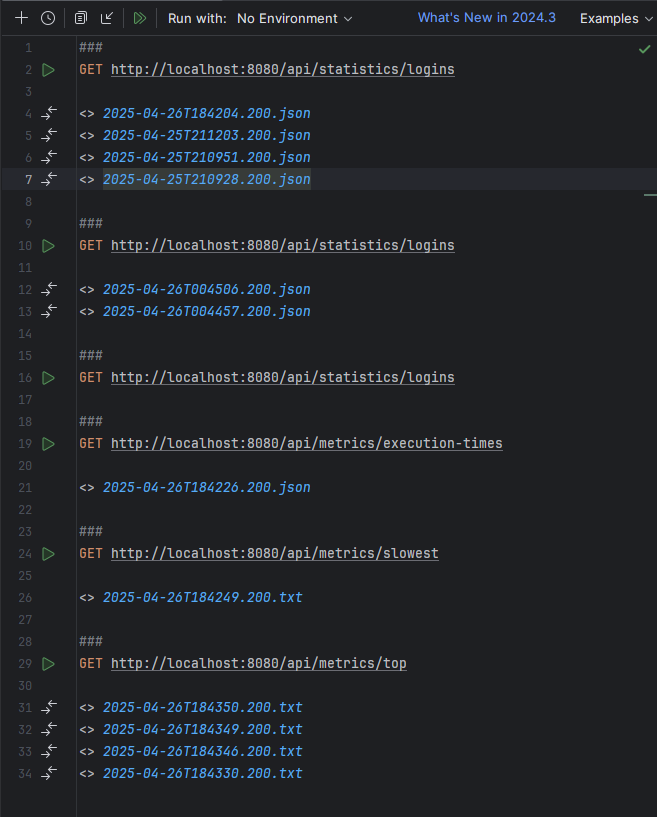
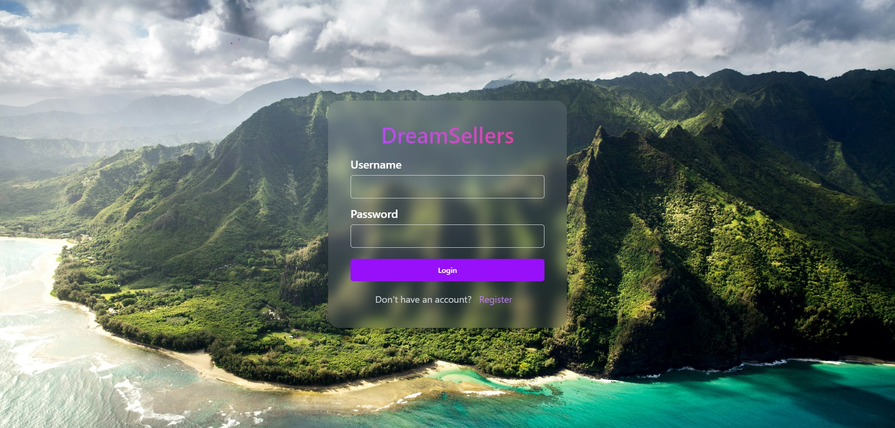
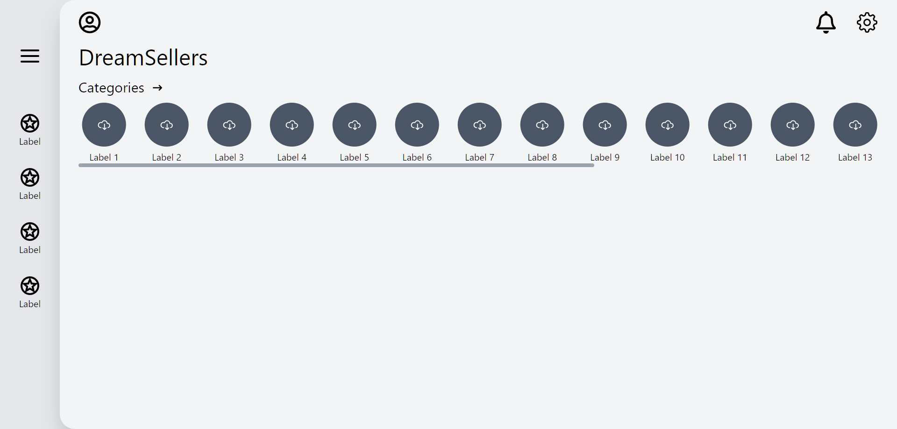

# 📦 DreamSellers Project

DreamSellers is a **fullstack web application** built with a **Spring Boot** backend and a **React** frontend.  
The project uses **Maven** for backend dependency management and **npm** for frontend package management.

## ✅ Prerequisites

Make sure you have the following installed on your machine:

- Java 17 or higher
- Maven 3.8 or higher
- Node.js 18 or higher (with npm)

## 🚀 How to Run

Clone the repository and navigate into the project directory.

### 1. Start the Backend

```bash
cd backend
mvn clean install
mvn spring-boot:run
```

### 2. Start the Frontend

```bash
cd frontend
npm install
npm run dev
```

# Screenshot of the enpoints managing the aspect programing



## The coresponding logs can be seen in folder logs

# Screenshots of the frontend app



